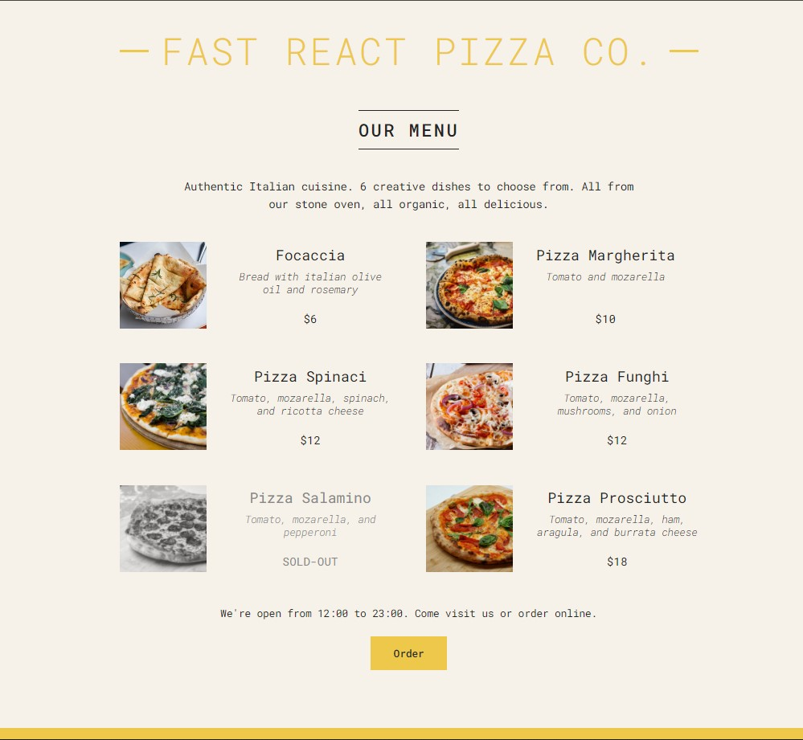

# Fast React Pizza Co.

**Fast React Pizza Co.** is a dynamic pizza menu app built using React. It displays a list of pizzas from a data file, shows whether the restaurant is open or closed based on the current time, and highlights pizzas that are sold out. This project demonstrates core React concepts like components, props, and conditional rendering.

## Demo

Check out the live version of the app:  
[Live Demo](https://frontend-web-development-mbne.vercel.app/)

## Features

- **Pizza Menu:** Displays a list of pizzas with their name, ingredients, and price.
- **Restaurant Status:** Uses the current time to determine if the restaurant is open, and displays an order button only if the restaurant is open.
- **Sold-Out Pizzas:** Dynamically marks pizzas as "SOLD-OUT" and applies styling accordingly.
- **Responsive Design:** The app adapts to different screen sizes, making it user-friendly on all devices.
