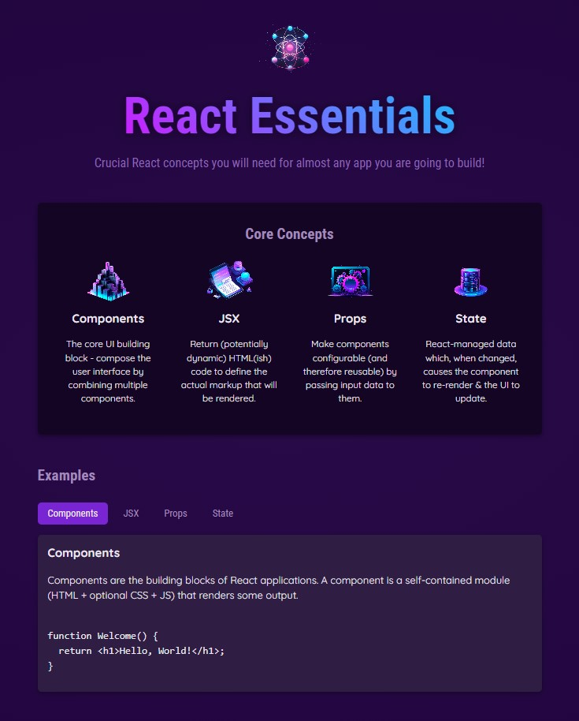

# React Core Concepts Project

This project demonstrates the **core concepts of React** such as **Components**, **JSX**, **Props**, and **State**. It presents these concepts interactively with examples and explanations. The project structure uses a modular approach by creating reusable components in React.

## Live Demo
[Live Demo](https://react-projects-two-tau.vercel.app/)

## Screenshot

## Project Overview

This project is divided into several key sections:

- **Core Concepts Section:** A list of fundamental React concepts like **Components**, **JSX**, **Props**, and **State**, each represented with an image, title, and description.
  
- **Examples Section:** Interactive tabs allow users to explore code examples for each concept, making learning more engaging.

## Key Features

- **Components:** Self-contained modules combining HTML, CSS, and JS.
  
- **JSX:** Allows embedding JavaScript expressions inside HTML-like syntax.
  
- **Props:** Makes components configurable by passing input data.
  
- **State:** Manages dynamic data within components and updates the UI accordingly.

## Technologies Used

- **React**: For building the interactive UI.
- **CSS**: For styling the components.
- **JavaScript (ES6+)**: For handling logic and dynamic rendering.